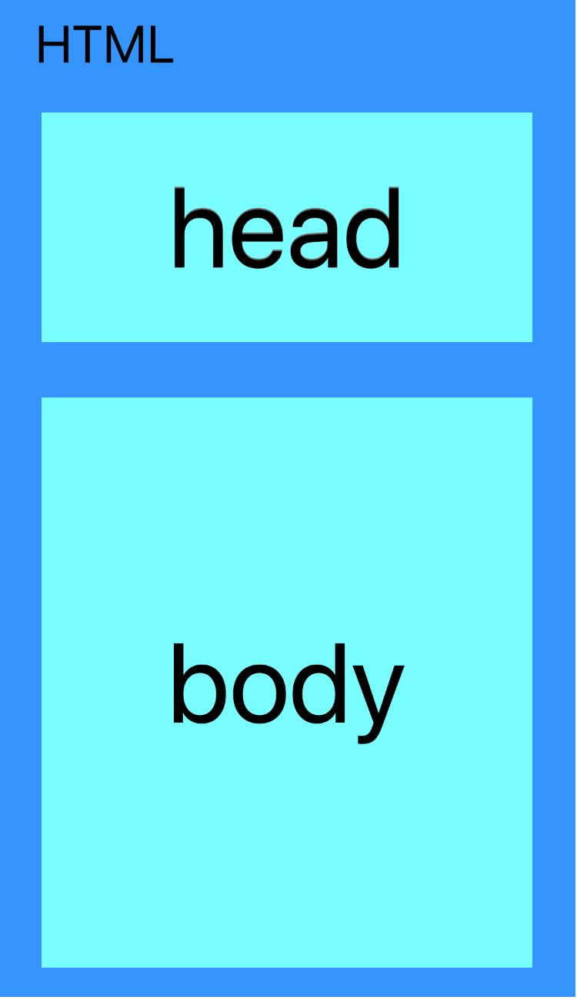

# html/cssの基礎

## html/cssとは

 言語 | 役割  | 機能 
--|---|--
 html  |  webサイトの構造を表す言語 |  webサイトに何を表示するかを記述する
 css  | webサイトにスタイルを当てる言語  |  文字の色や画像のサイズ、レイアウトなどを記述する

## HTMLタグの使用方法と基本的な用語  
HTMLは、①開始タグと終了タグで一つの要素、②一つのタグのみで成り立つ要素の2つがある。  
①の場合、開始タグと終了タグの間に表示したいものを記述する。終了タグには "/" をつける。
 ```html
 <!-- この枠で囲んだものはコメントアウトと言って書いたコードを無効化できる -->
 <!-- ①の例 -->
 構文： <開始タグ 属性="属性値">コンテンツ</終了タグ>
 <h1 class="html_basic">多くの要素は開始タグと終了タグが必要</h1>
 <!-- ②の例 -->
 構文： <タグ 属性="属性値">
 
 ```
## HTMLの基本構成  
<p>HTMLの構造を大きく分けると次のようになります。</p>
<p></p>
 ```html
 <!DOCTYPE html>
 <html>
 <head>
 	<!-- この中はウェブブラウザに現れない -->
 	<meta charset="utf-8">
 	<title>HTMLの基本</title>
 </head>
 <body>
 	ここに書かれたことは実際に表示される
 </body>
 </html>
 ```