# html/cssの基礎

## html/cssとは

 言語 | 役割  | 機能 
--|---|--
 html  |  webサイトの構造を表す言語 |  webサイトに何を表示するかを記述する
 css  | webサイトにスタイルを当てる言語  |  文字の色や画像のサイズ、レイアウトなどを記述する

## HTMLタグの使用方法と基本的な用語  
HTMLは、①開始タグと終了タグで一つの要素、②一つのタグのみで成り立つ要素の2つがある。  
①の場合、開始タグと終了タグの間に表示したいものを記述する。終了タグには "/" をつける。
 ```html
 <!-- この枠で囲んだものはコメントアウトと言って書いたコードを無効化できる -->
 <!-- ①の例 -->
 構文： <開始タグ 属性="属性値">コンテンツ</終了タグ>
 <h1 class="html_basic">多くの要素は開始タグと終了タグが必要</h1>
 <!-- ②の例 -->
 構文： <タグ 属性="属性値">
 
 ```
## HTMLの基本構成  
<p>HTMLの構造を大きく分けると次のようになります。</p>
<p></p>  

## 実際にHTMLを書いてみよう！  
```html
<!DOCTYPE html>
<html>
  <head>
    <!-- この中はウェブブラウザに現れない -->
    <meta charset="utf-8">
    <title>HTMLの基本</title>
  </head>
  <body>
    <!-- ここに書かれたことは実際に表示される -->
    <h1>Hello, world!</h1>
  </body>
</html>
```
## ウェブブラウザで書いたコードを確認しよう
### 書いたコードのファイルをダブルクリック
このアプリケーションで開くを押して、Chrome または Safari(ウェブブラウザ)を選択
<p>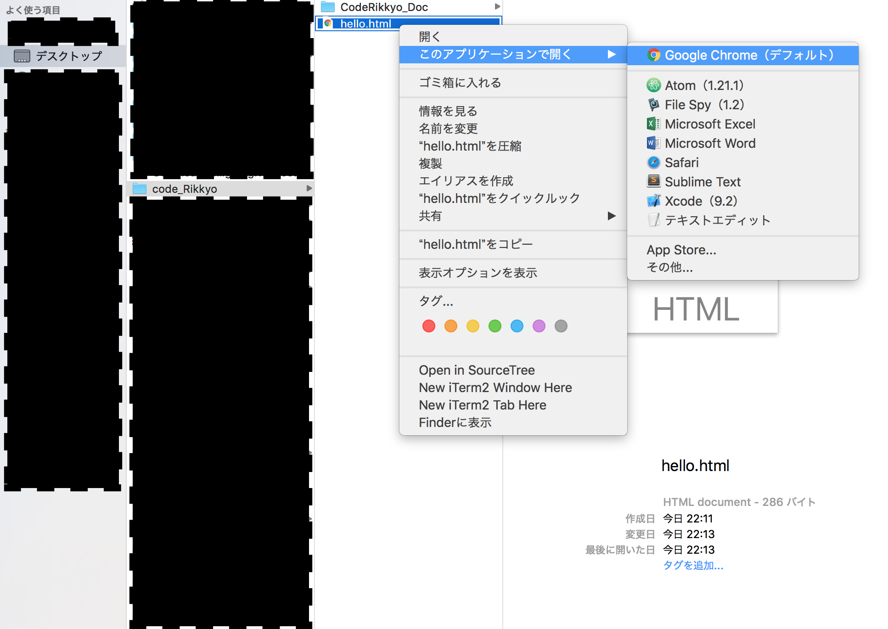</p>
問題がなければブラウザで自分の書いたコードが見れるはず
<p>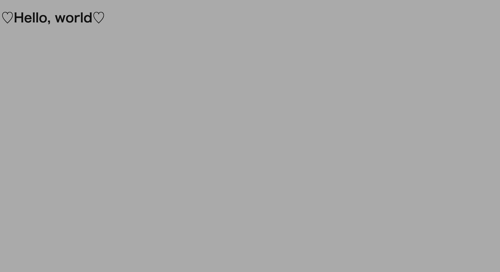</p>

## タグの一つ一つを知っていこう！
1. h1 ~ h6(見出しを作るためのタグ)
```html
<h1> h1 について知ろう！</h1>
<h2> h2 について知ろう！</h2>
<h3> h3 について知ろう！</h3>
<h4> h4 について知ろう！</h4>
<h5> h5 について知ろう！</h5>
<h6> h6 について知ろう！</h6>
```

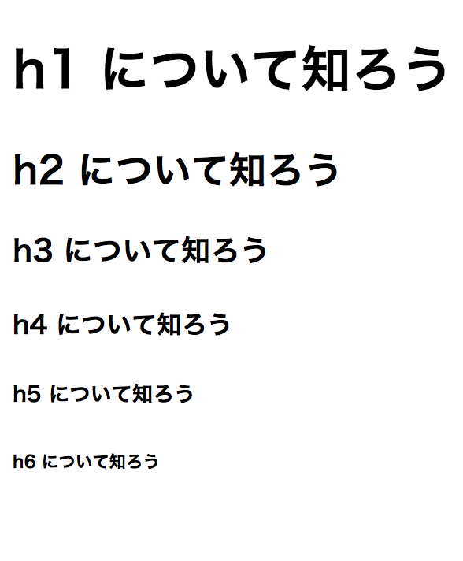
2. p(段落区切りを示すタグ)  

```html
<p>段落を示すのはpタグ！</p>
```

3. ul, li (リストを作るタグ)  

```html
<ul>
  <li>1個目</li>
  <li>2個目</li>
  <li>3個目</li>
  <li>4個目</li>
  <li>5個目</li>
</ul>
```
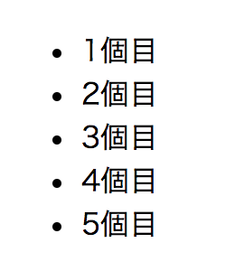

4. div (大きなかたまりを作るタグ)  !

```html
<div>
  <h1>かたまりの見出し</h1>
  <p>かたまりの文章</p>
</div>
```
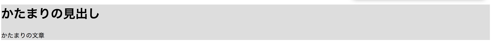

5. img (画像を貼るためのタグ)  !
```html

<div>
  <!-- フォルダの階層を辿って画像ファイルまで正確に記述する！ -->
  
</div>
```


6. table, tr, th, td (表を作るために必要なタグ)  !
```html

<div>
  <h1>テーブル１</h1>
  <table border="1">
    <caption>表題</caption><!-- 表題に使う -->
    <thead>
      <tr>
        <th>ヘッダ１</th>
        <th>ヘッダ２</th>
      </tr>
    </thead>
    <tbody>
      <tr>
        <td>１ー１</td>
        <td>２ー１</td>
      </tr>
      <tr>
        <td>１ー２</td>
        <td>２ー２</td>
      </tr>
    </tbody>
  </table>
</div>
```

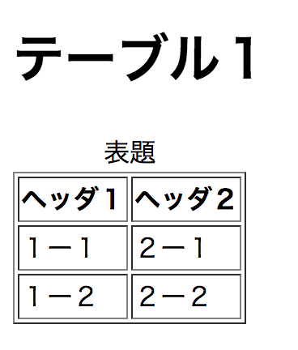

7. header,main,footer(Webページの上、真ん中、下を表す)
```html

<!DOCTYPE html>
<html lang="ja">
<head>
  <meta charset="utf-8">
  <title>ヘッダー、メイン、フッターの勉強</title>
</head>
<body>
<!-- ここからヘッダー -->
  <header style="background-color: #111">
    <div style="color: #fff">
      <h1>ヘッダー</h1>
      <p>ヘッダーだよ</p>
    </div>
  </header>
<!-- ここからメイン -->
  <main style="background-color: #aaa">
    <div>
      <h1>メイン</h1>
      <p>メインだよ</p>
    </div>
  </main>
<!-- ここからフッター -->
  <footer style="background-color: #fff">
    <div>
      <h1>フッター</h1>
      <p>フッターだよ</p>
    </div>
  </footer>
</body>
</html>

```
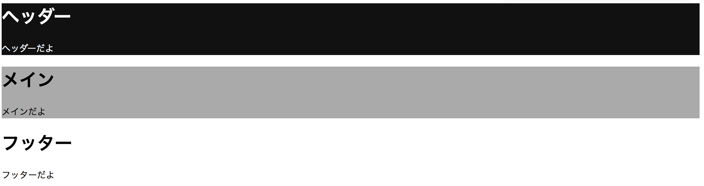

## CSSについて
CSSは、HTMLで作ったコンテンツを装飾するもの。
ここではCSSの当て方について学んでいこう。

## CSSの使い方
### 1. color, font-family , font-size
ここでは、テキストの色の変え方、フォントの変え方、フォントの大きさの変え方を学ぼう！
htmlファイル
```html

<!DOCTYPE html>
<html lang="ja">
<head>
  <title>CSSの勉強</title>
  <meta charset="utf-8">
  <!-- ↓ここでCSSのファイルを読み込む -->
  <link rel="stylesheet" href="hello.css">
</head>
<body>
  <div class="css_sample">
    <h1 class="change_color">
      赤色に変わるよ！
    </h1>
    <h1 class="change_font">
      h1をおしゃれにするよ！
    </h1>
    <h1 class="change_size">
      h1より大きくするよ！
    </h1>
  </div>
</body>
</html>

```
hello.css(読み込むCSSファイル)

```CSS

.change_color{
  color: #ff0000;
}

.change_font{
  font-family: 'Times New Roman';
}

.change_size{
  font-size: 80px;
}

```
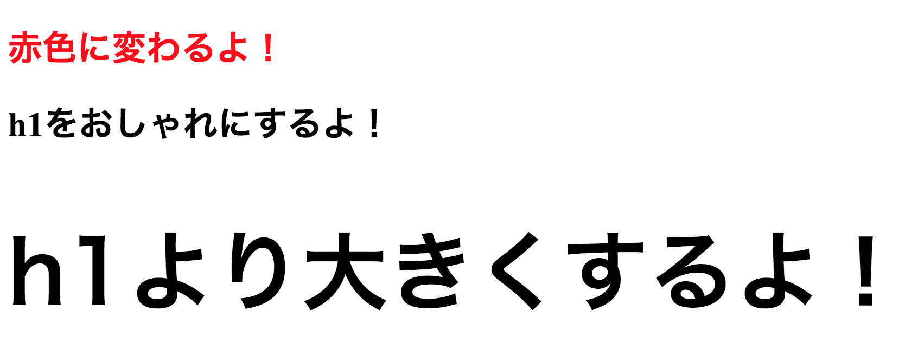

### 2. background-color, background-image, opacity

```html
<!DOCTYPE html>
<html>
<head>
  <title>back ground</title>
  <link rel="stylesheet" href="background.css">
</head>
<body>
  <div class = "container">
    <div class="image">
      <h1>背景画像</h1>
    </div>
    <div class="color">
      <h1>背景色</h1>
    </div>
  </div>
</body>
</html>
```

```CSS
/*全体に効くCSS*/
*{
  /*余白*/
  margin:0px;
}
.image{
  /*背景をmy_code.pngにする*/
  background-image: url(my_code.png);
  /*高さ*/
  height: 500px;
  /*背景画像の透明度*/
  opacity: 0.8;
  /*字の色*/
  color: #fff;
}

.color{
  /*背景色*/
  background-color: #aaa;
  /*高さ*/
  height: 500px;
}
```
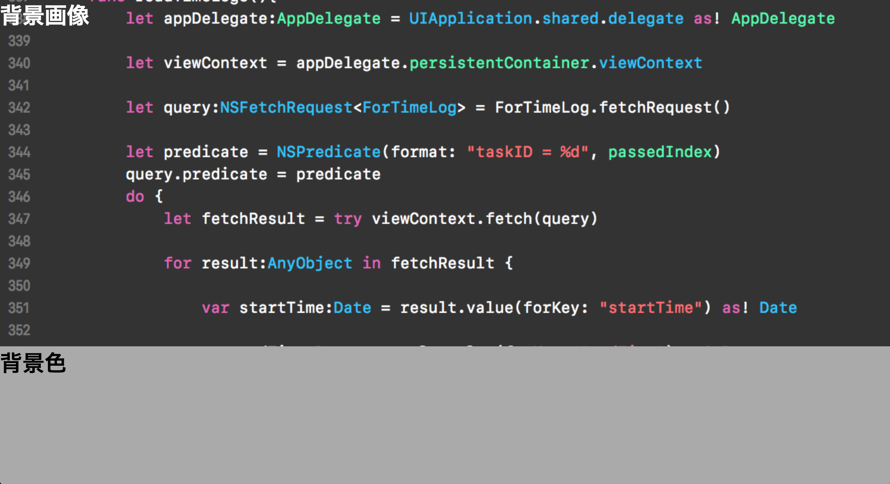

### 3.height, padding, margin
```html
<!DOCTYPE html>
<html>
<head>
  <meta charset="utf-8">
  <title>layout</title>
  <link rel="stylesheet" href="layout.css">
</head>
<body>
  <div class="container">
    <a href="#" class="btn facebook">FaceBook</a>
    <a href="#" class="btn twitter">Twitter</a>
    <a href="#" class="btn line">Line</a>
  </div>
</body>
</html>
```

```CSS
.container{
  /*上下・左右の余白を均一に決めている*/
  margin: 20px;
  /*containerの高さを決めている*/
  height: 40px;
}

.btn{
  /*左の余白*/
  margin-left: 10px;
  color: #fff;
  /*上下・左右の順に書く*/
  padding: 10px 20px;
}

.twitter{
  background-color: #00aced;
}

.facebook{
  background-color: #4267b2;
}

.line{
  background-color: #00b900;
}
```
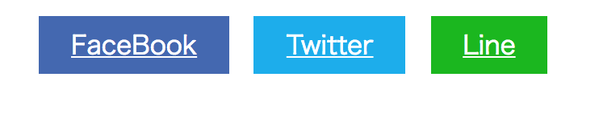

### 4. float, display, width, text-aline
```html
<!DOCTYPE html>
<html>
<head>
  <meta charset="utf-8">
  <title>display</title>
  <link rel="stylesheet" href="display.css">
</head>
<body>
  <div class="for_float">
    <h3>タイトル</h3>
    <ul>
      <li class="h_icons">要素１</li>
      <li class="h_icons">要素２</li>
      <li class="h_icons">要素３</li>
    </ul>
  </div>
  <div class="for_display">
    <div class="row first">
      <h1>左の記事</h1>
    </div>
    <div class="row second">
      <h1>真ん中の記事</h1>
    </div>
    <div class="row third">
      <h1>右の記事</h1>
    </div>
  </div>
</body>
</html>
```

```CSS
.for_float {
  /*高さを指定*/
  height: 70px;
  /*背景色を指定*/
  background-color: #808080;
  /*文字の色を指定*/
  color: #fff;
}

h3 {
  /*左に要素を寄せるときに使う*/
  float: left;
}

ul {
  /*右に要素を寄せるときに使う*/
  float: right;
  list-style: none;
}

.h_icons {
  /*左に要素を寄せるときに使う*/
  float: left;
  /*右の余白を40px*/
  margin-right:40px; 
}

.row {
  /*block要素のものをinline-blockにする*/
  display: inline-block;
  /*幅を要素の３３％にする*/
  width: 33%;
  /*インライン要素を真ん中寄せにする*/
  text-align: center;
}

.first {
  background-color: #ff0000;
}

.second {
  background-color: #00ff00;
}

.third {
  background-color: #0000ff;
}
```
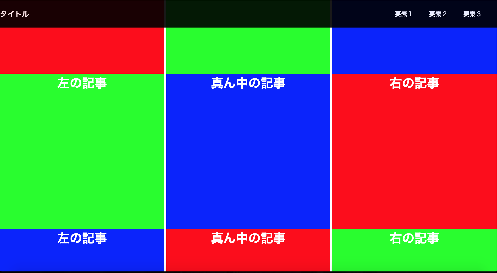

### 5.position

### 6. 復習（簡単なページを書いてみよう）

### (？. @media)やるかは未定

